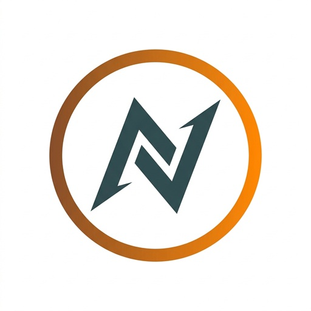
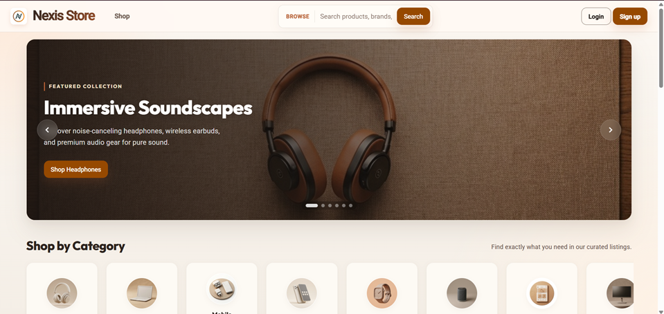
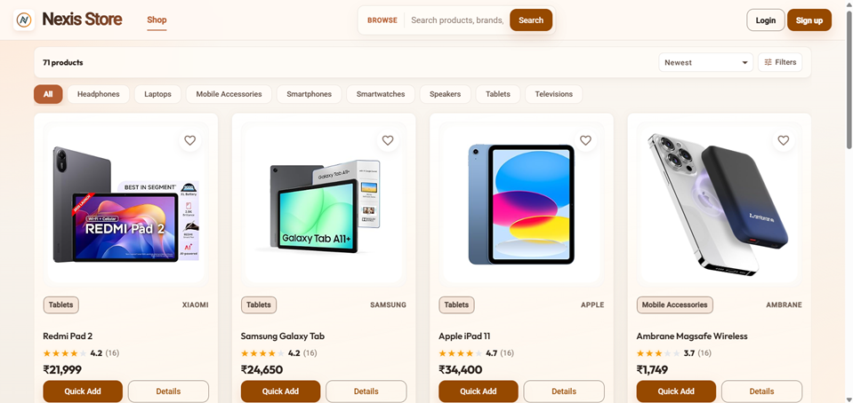
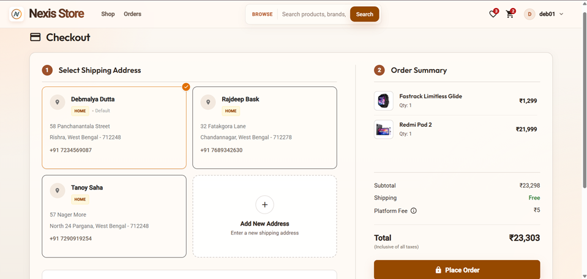
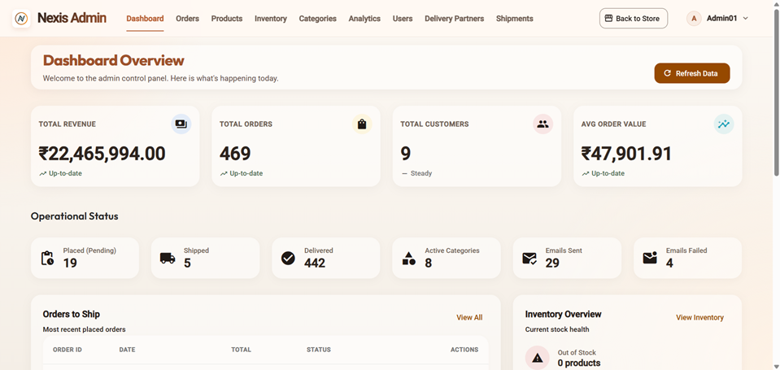

#  Nexis Store Frontend


[](https://nexis-store-sigma.vercel.app/)

A high-performance, responsive, and enterprise-grade e-commerce frontend built with **Angular 21**. This project serves as a showcase of modern Angular capabilities, implementing standalone components, strict typing, and a scalable architecture designed to handle real-world business requirements.

---

## 🚀 Live Demo & Deployment

The application is deployed and continuously delivered via **Vercel**. 

🌍 **Experience the Live App:** [https://nexis-store-sigma.vercel.app/](https://nexis-store-sigma.vercel.app/)

---

## 🎯 Key Highlights for Project Managers & Recruiters

- **Enterprise-Grade Architecture**: Built using a strict `Core` / `Shared` / `Features` domain-driven structure, ensuring the application is highly scalable, maintainable, and predictable.
- **Modern Angular Paradigms**: Fully utilizes Angular Standalone Components, eliminating `NgModules` for a lighter, faster application bundle. Leverages modern Signals alongside RxJS for reactive state management.
- **Comprehensive Feature Set**: Not just a generic storefront. This application includes dedicated portals for **Admins** and **Delivery Partners**, demonstrating the ability to handle complex, multi-role user flows.
- **Premium UX/UI**: Implements a highly polished, responsive design using a combination of **Angular Material**, custom **SCSS**, and **TailwindCSS** for rapid, consistent styling.
- **Clean Code Practices**: Strictly typed with TypeScript, follows clear naming conventions, and implements lazy-loaded routes for optimized initial load times.

---

## ✨ Available Features

The application is broken down into modular, lazy-loaded feature boundaries:

### 👤 Customer Facing
*   **Home & Landing**: Engaging hero sections, featured products, and category carousels.
*   **Product Catalog & Details**: Advanced filtering, search, rich product details, and image galleries.
*   **Authentication UX**: Secure login, registration, and password recovery flows with a redesigned, user-centric experience.
*   **Shopping Cart**: Real-time cart updates, price calculations, and persistent state.
*   **Checkout Flow**: Seamless multi-step checkout including shipping details and order review.
*   **Payment Integration**: Secure payment processing interface.
*   **Order Management**: Detailed order history and real-time status tracking for users.
*   **User Profile**: Address management, personal details, and account settings.
*   **Wishlist**: Save favorite items for later purchase.

### 🛡️ Admin & Logistics
*   **Admin Dashboard**: Centralized hub for managing products, viewing overall sales metrics, and handling user accounts. Includes data visualization using **Chart.js**.
*   **Delivery Partner Portal**: Dedicated interface for logistics personnel to manage, track, and update delivery statuses.

---

## 🛠️ Technology Stack

*   **Framework**: Angular 21
*   **UI Library**: Angular Material & Tailwind CSS
*   **Styling**: SCSS (Variables, Mixins, Component-scoped styles)
*   **State Management & Reactivity**: RxJS & Angular Signals
*   **Data Visualization**: Chart.js
*   **Tooling**: Angular CLI, Vite (via Angular Build), Prettier

---

## 🏗️ Architecture Overview

The codebase is organized to support massive growth without sacrificing readability:

```text
src/app/
├── core/         # Singleton services, guards, interceptors, app-wide configs
├── shared/       # Reusable UI components, pipes, directives, generic utilities
└── features/     # Domain-specific business logic (e.g., /cart, /checkout, /admin)
```

**Design Philosophy**: "Build the next clean step, not the final imagined system." The architecture prefers clear boundaries and component composition over premature abstractions and deep inheritance.

---

## 🚀 Quick Start

### Prerequisites
- Node.js (v18+)
- npm (v11+) or Angular CLI globally installed

### Installation

1. Clone the repository:
   ```bash
   git clone <repository-url>
   cd modern-ecommerce-ui
   ```

2. Install dependencies:
   ```bash
   npm install
   ```

3. Start the development server:
   ```bash
   npm run start
   ```

4. Open your browser and navigate to `http://localhost:4200/`.

---

## 📸 Application Showcase

### Home Page


### Product Catalog


### Checkout Flow


### Admin Dashboard


---

*Designed and built with modern web standards in mind.*
